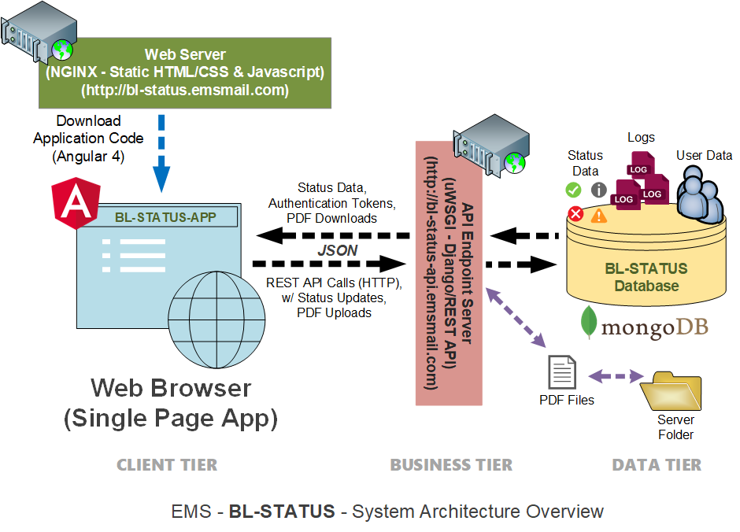

# bl-status-app: *Box Loading Status - Front-End Web Client Application*

## Overview
**bl-status-app** provides a web-based interface for end users to the **BL-STATUS** system.  It allows users to manage and track the status of Mailpiece samples (from the Sample Room) and Pallet Paperwork (from Postal Accounting), which are critical to the Box Loading Department in order to begin building Drop-Ship Pallets.  It is a ***Single Page Application*** (a.k.a "SPA") that asychronusly exchanges data with a back-end database (**MongoDB**) via a RESTful Web API endpoint (*bl-status-api.emsmail.com*). The diagram below shows how the web application fits into the overall architecture of the bl-status system:



The primary framework used to build this application is Google's **Angular** Open Source Front-end Javascript Framework  (http://angular.io). More specifically, the application utilizes the **Angular 4** version of the framework (*a semantic versioning reset of Angular 2*). Angular 2/4 represents a major departure from the original *AngularJS* framework (a.k.a Angular 1 - which is still widely used and supported). There are other additional Javascript and CSS libraries/packages being utilized in  this application:

* **ngx-bootstrap**: An Angular2/4-compatible port of the popular **Twitter Boostrap CSS framework** (https://github.com/valor-software/ngx-bootstrap) - provides styling and layout components for the UI's "look-and-feel" 
* **ngx-datatable**: An Angular2/4-compatible port of the popular **jQuery DataTables Javascript framework** (https://github.com/swimlane/ngx-datatable) - for displaying Status entry lists 
* **ng2-charts**: An Angular2/4-compatible port of the popular **Charts.JS Javascript framework** (https://valor-software.com/ng2-charts/) - for building and displaying charts and graphs
* **ng2-daterangepicker**: A programmable Angular2/4 component library for graphically selecting a date range (https://github.com/evansmwendwa/ng2-daterangepicker)
* **ng2-file-upload**: A programmable Angular2/4 component library for uploading a file to an endpoint URL (https://github.com/valor-software/ng2-file-upload)
* **ngx-toastr**: An Angular2/4-compatible port of the popular **Toastr Javascript framework** (https://github.com/scttcper/ngx-toastr) - for displaying pop-up messages/notifications 
* **ng2-select**: A programmable Angular2/4 component library for a drop-down selector (https://valor-software.com/ng2-select/)
* **ngx-loading**: A programmable Angular2/4 component library for displaying an animation during data loading (https://www.npmjs.com/package/ngx-loading)
* **file-saver**: A popular Javascript library for invoking the given Browser's native file saver API (https://github.com/eligrey/FileSaver.js) - used to dowload and save(or open) posted PDF's from the server
* **momentJS**: A popular Javascript library for working with dates and times (https://momentjs.com/)
* **pdfmake**: A popular Javascript libary for generating PDF's (http://pdfmake.org/)
* **font-awesome**: A popular CSS framework for displaying various fonts and icons (http://fontawesome.io/)

**NPM (Node Package Manager) Package JSON Config File (as of 11/3/2017)**
```json
{
  "name": "bl-status-app",
  "version": "0.0.1",
  "license": "MIT",
  "scripts": {
    "ng": "ng",
    "start": "ng serve",
    "build": "ng build",
    "test": "ng test",
    "lint": "ng lint",
    "e2e": "ng e2e"
  },
  "private": true,
  "dependencies": {
    "@angular/animations": "^4.3.5",
    "@angular/common": "^4.3.5",
    "@angular/compiler": "^4.3.5",
    "@angular/compiler-cli": "^4.3.5",
    "@angular/core": "^4.3.5",
    "@angular/forms": "^4.3.5",
    "@angular/http": "^4.3.5",
    "@angular/platform-browser": "^4.3.5",
    "@angular/platform-browser-dynamic": "^4.3.5",
    "@angular/router": "^4.3.5",
    "@swimlane/ngx-datatable": "^10.2.3",
    "@types/file-saver": "0.0.1",
    "bootstrap": "^3.3.7",
    "chart.js": "^2.6.0",
    "core-js": "^2.4.1",
    "file-saver": "^1.3.3",
    "font-awesome": "^4.7.0",
    "moment": "2.17.1",
    "ng2-charts": "^1.6.0",
    "ng2-daterangepicker": "^2.0.8",
    "ng2-file-upload": "^1.2.1",
    "ng2-select": "^1.2.0",
    "ngx-bootstrap": "^1.8.1",
    "ngx-loading": "^1.0.7",
    "ngx-toastr": "^6.0.1",
    "pdfmake": "0.1.26",
    "rxjs": "^5.4.2",
    "zone.js": "^0.8.14"
  },
  "devDependencies": {
    "@angular/cli": "^1.3.0",
    "@angular/compiler-cli": "^4.3.5",
    "@angular/language-service": "^4.3.5",
    "@types/jasmine": "~2.5.53",
    "@types/jasminewd2": "~2.0.2",
    "@types/node": "~6.0.60",
    "codelyzer": "~3.1.1",
    "jasmine-core": "~2.6.2",
    "jasmine-spec-reporter": "~4.1.0",
    "karma": "~1.7.0",
    "karma-chrome-launcher": "~2.1.1",
    "karma-cli": "~1.0.1",
    "karma-coverage-istanbul-reporter": "^1.2.1",
    "karma-jasmine": "~1.1.0",
    "karma-jasmine-html-reporter": "^0.2.2",
    "protractor": "~5.1.2",
    "ts-node": "~3.2.0",
    "tslint": "~5.3.2",
    "typescript": "^2.4.2"
  }
}
```

**Angular 4 CLI (Command Line Interface) JSON Config File (as of 11/3/2017)**
```json
{
  "$schema": "./node_modules/@angular/cli/lib/config/schema.json",
  "project": {
    "name": "bl-status-app"
  },
  "apps": [
    {
      "root": "src",
      "outDir": "dist",
      "assets": [
        "assets",
        "favicon.ico"
      ],
      "index": "index.html",
      "main": "main.ts",
      "polyfills": "polyfills.ts",
      "test": "test.ts",
      "tsconfig": "tsconfig.app.json",
      "testTsconfig": "tsconfig.spec.json",
      "prefix": "app",
      "styles": [
        "styles.css",
        "../node_modules/bootstrap/dist/css/bootstrap.min.css",
        "../node_modules/font-awesome/css/font-awesome.css",
        "../node_modules/ngx-toastr/toastr.css",
        "../node_modules/@swimlane/ngx-datatable/release/index.css",
        "../node_modules/@swimlane/ngx-datatable/release/themes/material.css",
        "../node_modules/@swimlane/ngx-datatable/release/assets/icons.css",
        "ng2-select.css"
      ],
      "scripts": [
        "../node_modules/pdfmake/build/pdfmake.min.js",
        "../node_modules/pdfmake/build/vfs_fonts.js",
        "../node_modules/moment/min/moment.min.js",
        "../node_modules/chart.js/dist/Chart.bundle.min.js",
        "../node_modules/file-saver/FileSaver.min.js"
      ],
      "environmentSource": "environments/environment.ts",
      "environments": {
        "dev": "environments/environment.ts",
        "prod": "environments/environment.prod.ts"
      }
    }
  ],
  "e2e": {
    "protractor": {
      "config": "./protractor.conf.js"
    }
  },
  "lint": [
    {
      "project": "src/tsconfig.app.json",
      "exclude": "**/node_modules/**"
    },
    {
      "project": "src/tsconfig.spec.json",
      "exclude": "**/node_modules/**"
    },
    {
      "project": "e2e/tsconfig.e2e.json",
      "exclude": "**/node_modules/**"
    }
  ],
  "test": {
    "karma": {
      "config": "./karma.conf.js"
    }
  },
  "defaults": {
    "styleExt": "css",
    "component": {}
  }
}
```

## Status Schema
The backend document-based database (*MongoDB*) has no inherent schema requirement.  Documents do not all have to have the same fields.  This provides flexibility as an application evolves.  However, in this application, we will imply a logical schema to provide a consistant, agreed upon model of the status information that is being managed. below is the list of data fields that will be managed.  This data partially provided by the List Processing **QualToPDF** .NET application. This data comes from the the supporting MSSQL database (*vm-sqlsvr-02.EMSProjects*)  Other fields will be provided and initialized by the backend API:

| Field Name    | Description   | Source  |
| ------------- |---------------| --------|
| **qualID**        | internal Presort Qualification ID code      | *QualToPDF* - (SQL **quals** table) |
| **projectID**     | internal List Processing project ID code    | *QualToPDF* - (SQL **quals** table) |
| **total**         | Total Record/Piece Count                    | *QualToPDF* - (SQL **quals** table) |
| **presort**       | Total Presorted output Count                | *QualToPDF* - (SQL **quals** table) |
| **fail**          | Failed Presort record/piece count (invalid/bad zip code data) | *QualToPDF* - (SQL **quals** table) |
| **spr**           | Single Piece (First Class) record/piece count | *QualToPDF* - (SQL **quals** table) |
| **class**         | USPS Class of mail (3rd/1st/2nd)            | *QualToPDF* - (SQL **quals** table) |
| | * *stored as **mailClass** in MongoDB - **class** is a Python reserved word* | |
| **type**          | Mail piece type (Letter/Flat/Postcard)      | *QualToPDF* - (SQL **quals** table) |
| **specs**         | Mail piece specifications (HxWxD, weight, Mail.dat Ver.)  | *QualToPDF* - (SQL **quals** table) |
| **counts**        | CSV-formatted counts for Legacy Job Ticket Import  | *QualToPDF* - (SQL **quals** table) |
| **isCurrent**     | Is this the most current version of the Prosort?  | *QualToPDF* - (SQL **quals** table) |
| **fileStamp**     | Date/Time Stamp of Presorted output File    | *QualToPDF* - (SQL **quals** table) |
| **timeStamp**     | Data/Time Stamp of the qual table row       | *QualToPDF* - (SQL **quals** table) |
| **isSampleComplete**| Sample completion flag (placeholder)      | *QualToPDF* - (SQL **quals** table) |
| **sampleStamp**   | Sample completion Date/Time Stamp           | *QualToPDF* - (SQL **quals** table) |
| **isAcctComplete** | Postal Accouting Papwork completion flag (placeholder) | *QualToPDF* - (SQL **quals** table) |
| **AcctStamp**     | Postal Accounting Date/Time Stamp           | *QualToPDF* - (SQL **quals** table) |
| **trayMax**       | Maximum number of pieces per container (Tray/Sack)  | *QualToPDF* - (SQL **quals** table) |
| **dpUser**        | Data Processing/List Processing Network user name | *QualToPDF* - (SQL **quals** table) |
| **sasUser**       | Sample Room Employee name/code              | *QualToPDF* - (SQL **quals** table) |
| **acctUser**      | Postal Accounting Employee name/code        | *QualToPDF* - (SQL **quals** table) |
| **isEpop**        | Is this an EPOP Pattern                     | *QualToPDF* - (SQL **quals** table) |
| **isTagsComplete**| Are Trag/Sack Tags complete?                | *QualToPDF* - (SQL **quals** table) |
| **TagsStamp**     | Tray/Sack Tags printed?                     | *QualToPDF* - (SQL **quals** table) |
| **tagsUser**      | Print room Employee name/code               | *QualToPDF* - (SQL **quals** table) |
| **hasCRRT**       | Does Presort contain CAR-RT pieces          | *QualToPDF* - (SQL **quals** table) |
| **hasOrigin**     | Does Presort contain Origin-SCF/NDC pieces  | *QualToPDF* - (SQL **quals** table) |
| -- | -- | -- |
| **projectName**   | Mailing Campaign/Project Name               | *QualToPDF* - (SQL **projects** table) |
| **EstDropDate**   | Estimated Drop Date                         | *QualToPDF* - (SQL **projects** table) |
| -- | -- | -- |
| **client**        | Client name                                 | *QualToPDF* - (SQL **clients** table)  |
| -- | -- | -- |
| **sampleStatus**                      | current Sample Status (New, In Process, Issue, Complete) | *bl-status-api* - (appended field) |
| **paperworkStatus**                   | current Paperwork Status (New, In Process, Issue, Complete) | *bl-status-api* - (appended field) |
| **palletTagFileUser**                 | Who uploaded Pallet Tags              | *bl-status-api* - (appended field) |
| **palletTagFileDownloadCount**        | Pallet Tag PDF download count         | *bl-status-api* - (appended field) |
| **currentPalletTagFile**              | Pallet Tag PDF file name              | *bl-status-api* - (appended field) |
| **palletTagFileUploadDateTime**       | Pallet Tag PDF Upload Date/Time       | *bl-status-api* - (appended field) |
| **palletWorksheetFileUser**           | Who uploaded Pallet Worksheet         | *bl-status-api* - (appended field) |
| **palletWorksheetFileDownloadCount**  | Pallet Worksheet PDF download count   | *bl-status-api* - (appended field) |
| **palletWorksheetFileUploadDateTime** | Pallet Worksheet PDF Upload Date/Time | *bl-status-api* - (appended field) |
| **currentPalletWorksheetFile**        | Pallet Worksheet file name            | *bl-status-api* - (appended field) |
| **palletTagReplacementCount**         | Pallet Tag PDF replacement count      | *bl-status-api* - (appended field) |
| **palletWorksheetReplacementCount**   | Pallet Worksheet PDF replacement count | *bl-status-api* - (appended field) |
| **postalAccountingNotes**             | Accounting Notes                      | *bl-status-api* - (appended field) |
| **sampleRoomNotes**                   | Sample Room Notes                     | *bl-status-api* - (appended field) |


This project was generated with [Angular CLI](https://github.com/angular/angular-cli) version 1.3.0.

## Development server

Run `ng serve` for a dev server. Navigate to `http://localhost:4200/`. The app will automatically reload if you change any of the source files.

## Code scaffolding

Run `ng generate component component-name` to generate a new component. You can also use `ng generate directive|pipe|service|class|guard|interface|enum|module`.

## Build

Run `ng build` to build the project. The build artifacts will be stored in the `dist/` directory. Use the `-prod` flag for a production build.

## Running unit tests

Run `ng test` to execute the unit tests via [Karma](https://karma-runner.github.io).

## Running end-to-end tests

Run `ng e2e` to execute the end-to-end tests via [Protractor](http://www.protractortest.org/).
Before running the tests make sure you are serving the app via `ng serve`.

## Further help

To get more help on the Angular CLI use `ng help` or go check out the [Angular CLI README](https://github.com/angular/angular-cli/blob/master/README.md).
